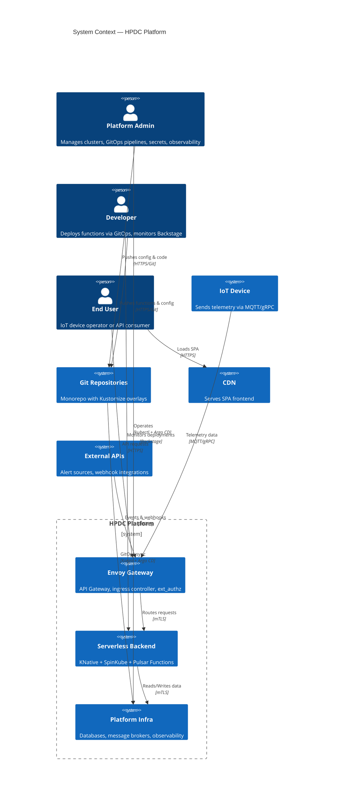
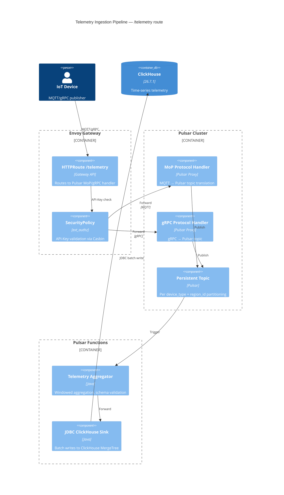
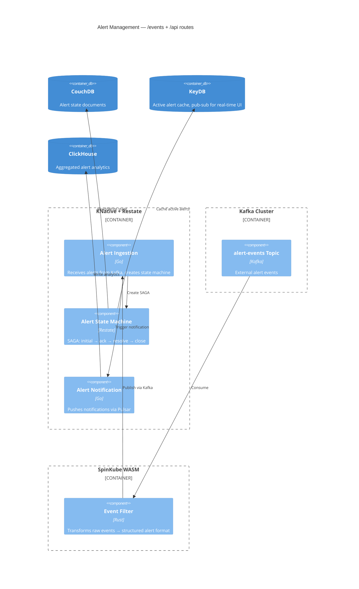
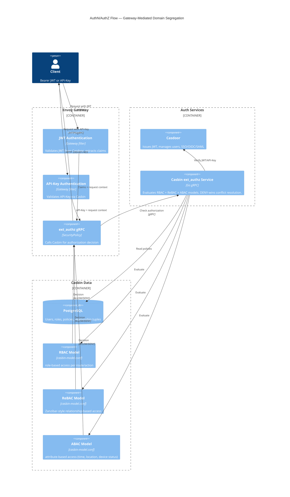

# C4 Model — HPDC

## Level 1: System Context



## Level 2: Container Diagram

```mermaid
C4Container
  title Container Diagram — HPDC Platform

  Person(user, "End User / IoT Device", "API consumer")

  System_Boundary(gateway, "Gateway Layer") {
    Container(eg, "Envoy Gateway", "K8s Gateway API", "Ingress, TLS termination, rate limiting, ext_authz")
    Container(casdoor, "Casdoor", "Go", "AuthN: JWT issuance, SSO, OIDC, API-Key validation")
    Container(casbin, "Casbin ext_authz", "Go gRPC", "AuthZ: RBAC + ReBAC + ABAC, DENY-wins")
  }

  System_Boundary(compute, "Compute Layer") {
    Container(knative, "KNative Serving + Eventing", "Go/Python", "Serverless scale-to-zero, Restate SAGAs")
    Container(spinkube, "SpinKube WASM", "Rust/JS/Go", "WASM transforms on Kafka topics")
    Container(pulsarFn, "Pulsar Functions", "Java", "Stream aggregation, JDBC Sink to ClickHouse")
    Container(argo, "Argo Workflows", "", "CI/build/deploy DAGs")
  }

  System_Boundary(messaging, "Messaging Layer") {
    Container(pulsar, "Apache Pulsar", "4.2.3", "Primary message backbone, MQTT/gRPC, 100K+ RPS")
    Container(kafka, "Apache Kafka", "latest", "Secondary event streams, Spin WASM input")
  }

  System_Boundary(data, "Data Layer") {
    ContainerDb(couchdb, "CouchDB", "3.5.2", "Document DB, CRM/ERP docs, entity hierarchy, _changes feed")
    ContainerDb(yugabyte, "YugabyteDB", "2026.1.0.1", "Distributed SQL, transactional state, CDC")
    ContainerDb(arcadedb, "ArcadeDB", "26.7.3", "Multi-model graph, entity lineage")
    ContainerDb(clickhouse, "ClickHouse", "26.7.1", "Time-series telemetry analytics")
    ContainerDb(keydb, "KeyDB", "latest", "Clustered cache, pub-sub, alert state, dedup set")
    ContainerDb(postgres, "PostgreSQL", "", "Casdoor + Casbin auth data only")
  }

  System_Boundary(ops, "Operations") {
    Container(vm, "VictoriaMetrics", "1.148.0", "Metrics storage, cluster mode")
    Container(grafana, "Grafana", "", "Dashboards, alerting")
    Container(hubble, "Cilium Hubble", "", "Network observability")
    Container(infisical, "Infisical", "", "Secrets management, CSI Driver injection")
  }

  System_Boundary(gitops, "GitOps Layer") {
    Container(kargo, "Kargo", "1.11.0", "Freight-based multi-stage promotion")
    Container(argocd, "Argo CD", "", "Application sync, Sync Waves")
  }

  Rel(user, eg, "HTTPS/MQTT/gRPC")
  Rel(eg, casdoor, "JWT validation")
  Rel(eg, casbin, "ext_authz gRPC")
  Rel(eg, knative, "Route /api/*")
  Rel(eg, pulsar, "Route /telemetry/*")
  Rel(eg, kafka, "Route /events/*")
  Rel(eg, couchdb, "Route /data/*")
  Rel(eg, pulsar, "Route /gql → Hasura")

  Rel(knative, pulsar, "Publish/subscribe", "Protobuf CommonEnvelope")
  Rel(knative, kafka, "Publish/subscribe", "Protobuf CommonEnvelope")
  Rel(knative, keydb, "Stateful operations")
  Rel(knative, couchdb, "Document CRUD")
  Rel(knative, yugabyte, "Transactional state")

  Rel(spinkube, kafka, "Consume/transform")
  Rel(spinkube, clickhouse, "Write analytics")

  Rel(pulsarFn, pulsar, "Stream processing")
  Rel(pulsarFn, clickhouse, "JDBC Sink")

  Rel(kargo, argocd, "Promotes freight")
  Rel(git, kargo, "Git push → Freight")
  Rel(argocd, knative, "Syncs manifests")
  Rel(argocd, spinkube, "Syncs manifests")
  Rel(argocd, pulsarFn, "Syncs manifests")
```

## Level 3: Component — Telemetry Pipeline



## Level 3: Component — Alert State Machine



## Level 3: Component — Auth Flow


